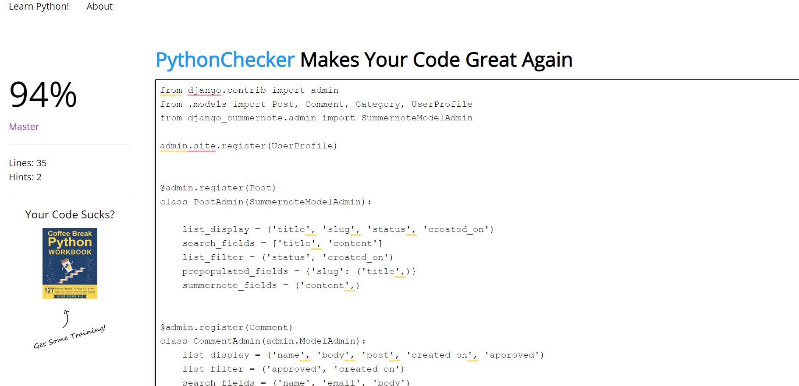
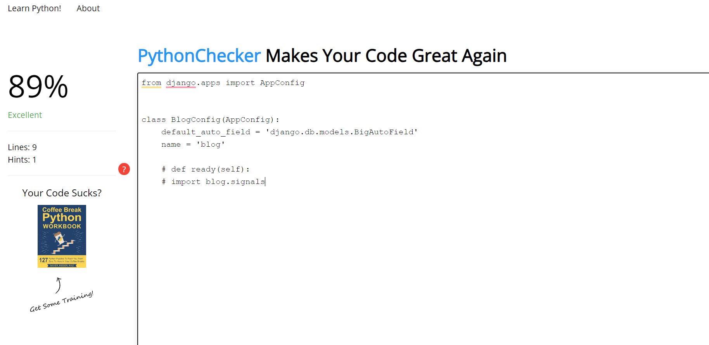
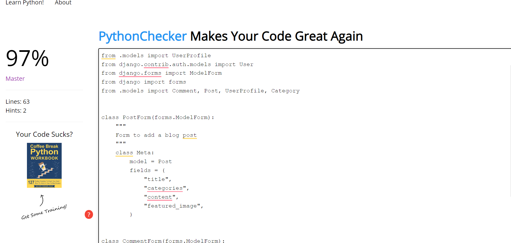
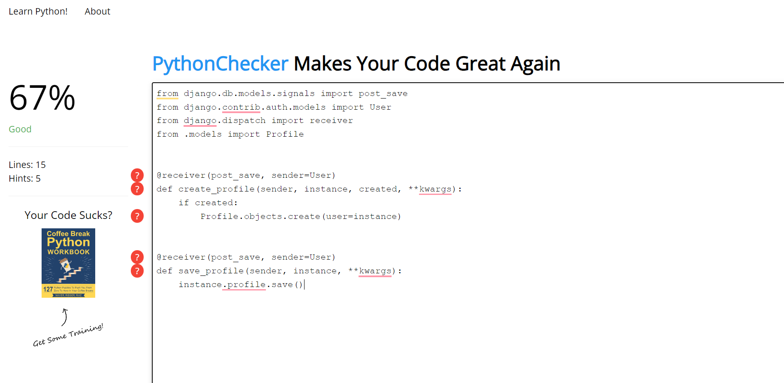
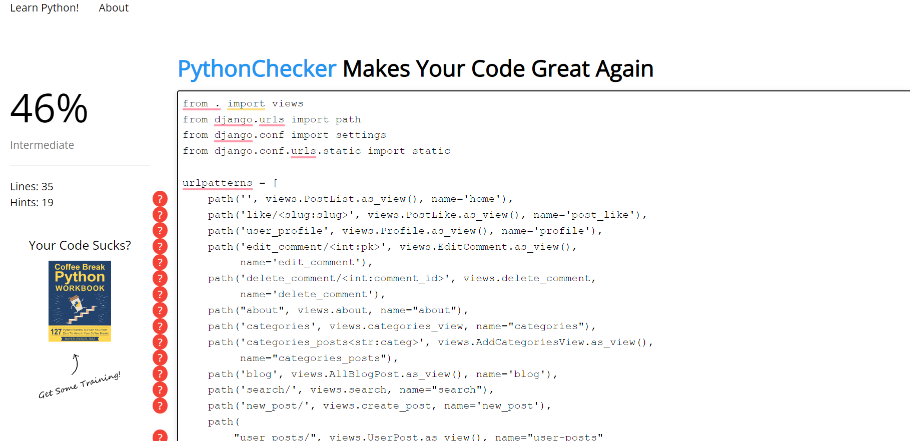

# Testing

Back to the [README](README.md)

# Table of Contents

- [Validator Testing](#validator-testing)
  * [HTML](#html)
  * [CSS](#css)
  * [Javascript](#javascript)
  * [Python](#python)

## Validator Testing

### HTML

All HTML pages were run through the [W3C HTML Validator](https://validator.w3.org/). 
There were found some errors but I managed to fix them.
See the results in the below table.

| Page                 | Logged Out | Logged In |
|----------------------|------------|-----------|
| base.html            | No errors  | No errors |
| index.html           | No errors  | No errors |
| about.html           | No errors  | No errors |
| blog.html            | No errors  | No errors |
| post_detail.html     | No errors  | No errors |
| search.html          | No errors  | No errors |
| user_profile.html    | No errors  | No errors |
| user_posts.html      | No errors  | No errors |
| edit_comment.html    | No errors  | No errors |
| update_post.html     | No errors  | No errors |
| delete_post.html     | No errors  | No errors |
| delete_comment.html  | No errors  | No errors |
| login.html           | No errors  | No errors |
| logout.html          | No errors  | No errors |
| signup.html          | No errors  | No errors |

### CSS

All CSS file went through the[W3C CSS Validator](https://jigsaw.w3.org/css-validator/)
There were found some errors but I managed to fix them.
See the results in the below table.

| Page                 | Logged Out | Logged In |
|----------------------|------------|-----------|
| base.html            | No errors  | No errors |
| index.html           | No errors  | No errors |
| about.html           | No errors  | No errors |
| blog.html            | No errors  | No errors |
| post_detail.html     | No errors  | No errors |
| search.html          | No errors  | No errors |
| user_profile.html    | No errors  | No errors |
| user_posts.html      | No errors  | No errors |
| edit_comment.html    | No errors  | No errors |
| update_post.html     | No errors  | No errors |
| delete_post.html     | No errors  | No errors |
| delete_comment.html  | No errors  | No errors |
| login.html           | No errors  | No errors |
| logout.html          | No errors  | No errors |
| signup.html          | No errors  | No errors |

### Python Validation - PEP8

* Python testing was done using the PEP8 Online to ensure there were no syntax errors in the project. All python files
were entered into the online checker and no errors were found in any of the custom codes.

### Montessori Inspired - Blog
* admin.py 
* apps.py
* models.py
* forms.py
* signals.py
* urls.py
* views.py.png>)

### Montessori Inspired - Posts
* admin.py 
* apps.py
* models.py
* forms.py
* signals.py
* urls.py
* views.py.png>)

* [Lighthouse](#lighthouse)

- [Bugs](#bugs)
  * [Fixed Bugs](#fixed-bugs)

  * [Unfixed bugs:](#unfixed-bugs-)

## User Story Testing

