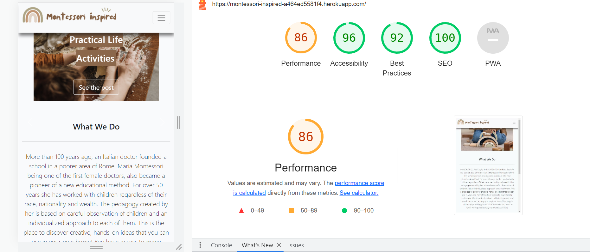
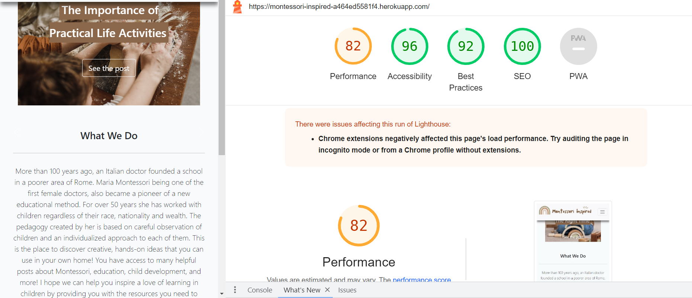
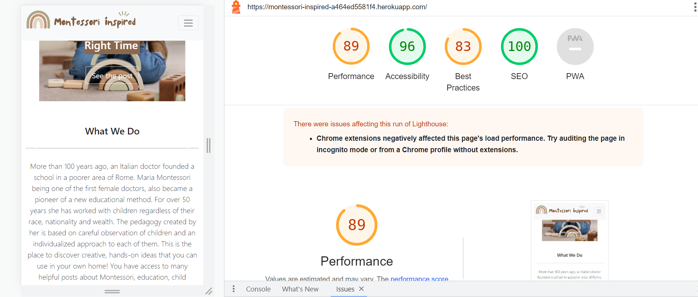
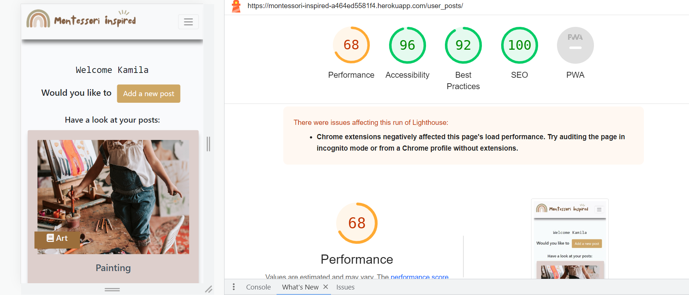
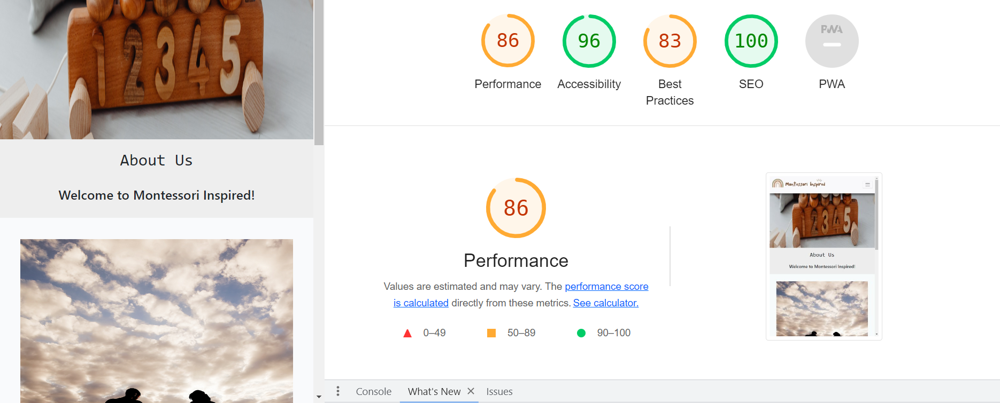
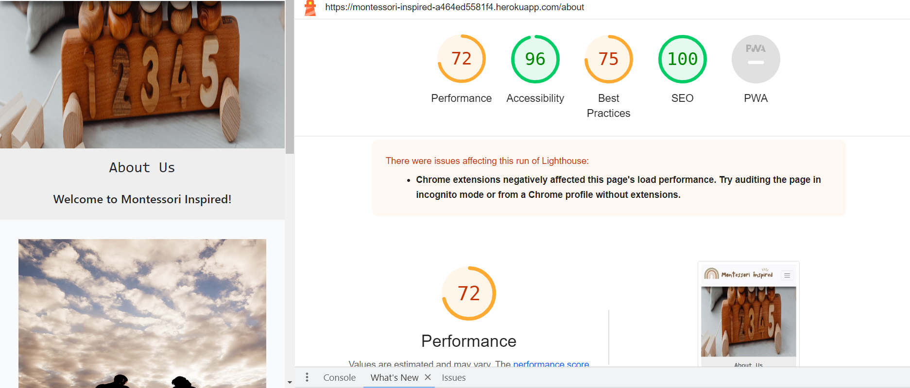

# Testing

Back to the [README](README.md)

### Validation
I used the following validation tools to validate HTML, CSS, PYTHON codes. Below the link of TESTING.md file, which includes all validation results. 

- HTML using [W3C HTML validator](https://validator.w3.org/)
- CSS using [Jigsaw CSS validator](https://jigsaw.w3.org/css-validator/)
- Python via [PEP8 CI Python Linter](https://pep8ci.herokuapp.com/)

## Validator Testing

### HTML

All HTML pages were run through the [W3C HTML Validator](https://validator.w3.org/). 
There were found some errors but I managed to fix them.
See the results in the below table.

| Page                 | Logged Out | Logged In |
|----------------------|------------|-----------|
| base.html            | No errors  | No errors |
| index.html           | No errors  | No errors |
| about.html           | No errors  | No errors |
| blog.html            | No errors  | No errors |
| post_detail.html     | No errors  | No errors |
| search.html          | No errors  | No errors |
| user_profile.html    | No errors  | No errors |
| user_posts.html      | No errors  | No errors |
| edit_comment.html    | No errors  | No errors |
| update_post.html     | No errors  | No errors |
| delete_post.html     | No errors  | No errors |
| delete_comment.html  | No errors  | No errors |
| login.html           | No errors  | No errors |
| logout.html          | No errors  | No errors |
| signup.html          | No errors  | No errors |

### CSS

All CSS file went through the[W3C CSS Validator](https://jigsaw.w3.org/css-validator/)
There were found some errors but I managed to fix them.
See the results in the below table.

### Python Validation - PEP8

* Python testing was done using the PEP8 Online to ensure there were no syntax errors in the project. All python files
were entered into the online checker and no errors were found in any of the custom codes.

### Montessori Inspired - Blog
* admin.py 
* apps.py
* models.py
* forms.py
* signals.py
* urls.py
* views.py.png>)

### Montessori Inspired - Posts
* admin.py 
* apps.py
* models.py
* forms.py
* signals.py
* urls.py
* views.py.png>)

### Lighthouse

Lighthouse was used to test Performance, Best Practices, Accessibility and SEO on Desktop.

* Home page for desktop

* Home page for mobiile

* Blog page for desktop

* Blog page for mobile

* About page for desktop

* About page for mobile

## User Story Testing

### Site User

1. As a Site User I can immediately understand the purpose of the site so that I can decide if it meets my needs. 
  * The porpouse of the site is clear and easy to understand for the visiting user.
2. As a Site User I can intuitively navigate around the site so that I can find content and understand where I am on the site.
  * The navigation around the website is as well very intuitiv and easy for the user, search bar helps for quickly find a 
   specifical posts.
3. As a Site User I can see a list of posts so that I can select the one that I want to read.
  * The user can navigate to blog page and see all the posts. 
4. As a Site User I can click on a post and read the full content.
  * The user after clicking on a title of the post will be transter to the post detail page and can read teh content of the post. 
5.  As a Site User I can see the number of likes on every post so that I can see which is the most popular or viral.
  * The site user can see the number of likes on every post.
6.  As a Site User I can navigate easy on the site through paginated list of posts so that I feel comfortable using the site.
  * The blog page and as well My posts page shows the posts paginated by 9 posts and the prev/next button.
7.  As a Site User I can view comments on a specific post so that I can read the conversations between different users on the site.
  * The user can see a list of comments posted so far under the post.

### After loggin-in to the website:

1. As a Site User I can sign up an account so that I can like and comment on posts, create a profile page, create own posts and edit remove my posts.
  * As a logged in user I can leave my own post and than edit/delete them.
2. As a Site User I can edit my comment so that I can change the content if I want to.
  * As a logged in user I can edit my comments.
3. As a Site User I can remove my comment so that I have full control of my comments
  * As a logged in user I can delete my comments.
4. As a Site User I can choose to see my own posts so that I can find them easily 
  * As a logged in user I can go to My Posts page and I can see there all my posts.
5. As a Site User I can log out from the site so that I can feel safe that nobody can access my information 
  *As a logged in I can log out from the site.
6. As a Site User I can edit my profile, so that I can keep the information up to datee 
  * This function wasn't created yet. 
7. As a Site User I can  see my login status so that I know if I'm logged in or out 
  * As a logged in user I can see if I am logged in or not.
8. As a Site User I can delete my account so that I can remove my details and posts if needed 
  * This function wasn't created yet. 
9. As a Site User I can like/unlike posts that I enjoyed/I didn’t enjoy so that I can interact with the content
  * As a logged in User I can like/unlike posts.
10. As a Site User I can log out from the website
  * As a logged in user I can log out from the website.

### As a website Admin:

1. As a Site Admin I can log out from the site so that I can feel safe that nobody can access my information.
  * As a Site Admin I can log out from the site.
2. As a Site Admin I can create, read, update, and delete posts so that I can manage my blog content.
  * As a Site Admin I can create, read, update, and delete posts.
3. As a Site Admin I can approve posts so that I can secure good quality of the content.
  * As a Site Admin I can approve posts. 
4. As a Site Admin I can approve and disapprove comments so that I can secure a safe environment for the Site Users.
  * As a Site Admin I can approve and disapprove comments.
5. As a Site Admin I can create drafts of my posts that they can be reviewed and finalized later.
  * As a Site Admin I can create drafts of my posts.
6. As a Site Admin I can access an admin area so that I can get a general understanding of logged in users, number of likes and number of posts.
  * As a Site Admin I can access an admin area.

### Manual Testing

Testing has taken place continuously throughout the development of the project. Each view was tested regularly.

### Frontend
* The Signup, Login, and Logout system is working well. It shows the right interactive message to the users.
* All the internal links are working and bring the user to the right page on the website.
* All the external links are working and bring the user to the right social media page by opening a new browser tab.
* The drop-down menu in the navbar shows a list of connected web pages.
* The pagination system is working. It adds another page after 9 posts on the page.
* On the Post Details Page, the Like/unlike functionality is working without issues and shows the right amount of likes.
* The comment form works properly and it submits a new comment once the form is completed by a registered user.  The comment must be approved by the admin first. An interactive message informing about successful comment posting is appearing.
* The functionality to delete comments is doing its job, however, the admin should approve first this function, and this is not working properly. The Bootstrap model is open to asking the user if they want to delete the message. Once the action is complete, the user should see an interactive message, and this function is not working as it should.
* The functionality to update a post, is working well. A new page is open, to update the post when the button edit is pressed.
The change in the post should be approved by the admin, however, the post is updated without approval and the user is taken back to the user's page.

### Backend/Admin Panel

* All the models are working without issues.  
  I have created, deleted, and updated data in all models without errors. 
  The models have the behavior expected for what they were built for.
* When the author is posting a new post all the required fields have to be filled otherwise the author can't submit the post to 
  the database.
* Whenever a user submits a post the Superuser has to approve it before it will be displayed on the website.

### Unfixed bugs:
* Whenever a user comments on a post, the Superuser has to approve it before it will be displayed on the website -  This functionality is not working correctly.
* Not all interactive messages displaying correctly- they are not showing up after creating or editing the post.

### To improve:

There is a lot's of thing that I would like to add to this blog like: 
* possibilty of updating a profile page, changing the image photo, adding some information about the user,
* adding an admin page for so the admin has easier acces to what's happening on the blog,
* adding a categories page so the user can even easier see the types of contet on the blog,
* make a search function more precise so user can easier find a particular content.