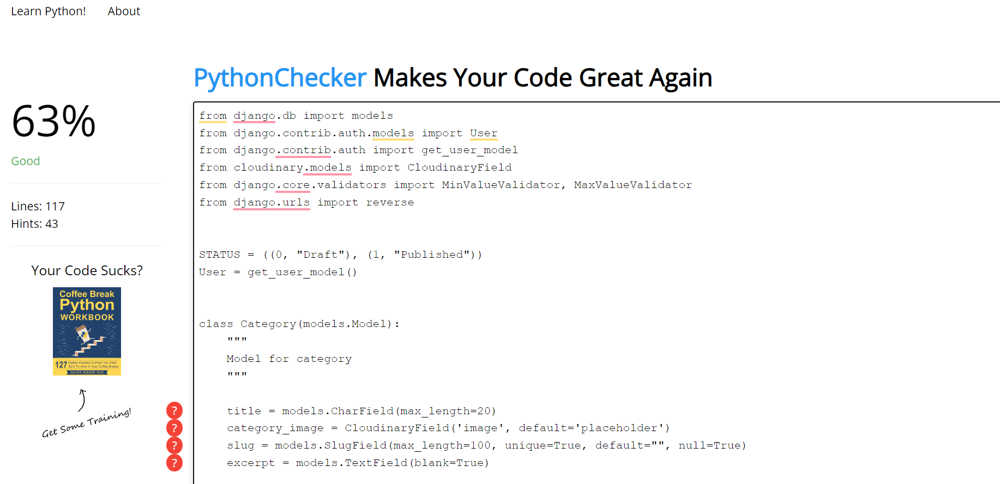

# Testing

Back to the [README](README.md)

# Table of Contents

- [Validator Testing](#validator-testing)
  * [HTML](#html)
  * [CSS](#css)
  * [Javascript](#javascript)
  * [Python](#python)

* [Lighthouse](#lighthouse)
  
* [User Story Testing](#User-story-testing)
 

## Validator Testing

### HTML

All HTML pages were run through the [W3C HTML Validator](https://validator.w3.org/). 
There were found some errors but I managed to fix them.
See the results in the below table.

| Page                 | Logged Out | Logged In |
|----------------------|------------|-----------|
| base.html            | No errors  | No errors |
| index.html           | No errors  | No errors |
| about.html           | No errors  | No errors |
| blog.html            | No errors  | No errors |
| post_detail.html     | No errors  | No errors |
| search.html          | No errors  | No errors |
| user_profile.html    | No errors  | No errors |
| user_posts.html      | No errors  | No errors |
| edit_comment.html    | No errors  | No errors |
| update_post.html     | No errors  | No errors |
| delete_post.html     | No errors  | No errors |
| delete_comment.html  | No errors  | No errors |
| login.html           | No errors  | No errors |
| logout.html          | No errors  | No errors |
| signup.html          | No errors  | No errors |

### CSS

All CSS file went through the[W3C CSS Validator](https://jigsaw.w3.org/css-validator/)
There were found some errors but I managed to fix them.
See the results in the below table.

### Python Validation - PEP8

* Python testing was done using the PEP8 Online to ensure there were no syntax errors in the project. All python files
were entered into the online checker and no errors were found in any of the custom codes.

### Montessori Inspired - Blog
* admin.py 
* apps.py
* models.py
* forms.py
* signals.py
* urls.py
* views.py.png>)

### Montessori Inspired - Posts
* admin.py 
* apps.py
* models.py
* forms.py
* signals.py
* urls.py
* views.py.png>)

### Lighthouse

Lighthouse validation was run on all pages (both mobile and desktop) in order to check accessibility and performance.

| Page           | Performance  | Accessibility | Best Practices  | SEO |
|----------------|:------------:|:-------------:|:---------------:|:---:|
|                |              |               |                 |     |
| Desktop        |              |               |                 |     |
| Home           |          100 |           100 |             100 | 100 |
| About us       |           99 |            98 |             100 | 100 |
| Blog           |           99 |           100 |             100 | 100 |
| My posts       |           99 |           100 |             100 | 100 |
| Post detail    |           99 |           100 |             100 | 100 |
| Add post       |           99 |            98 |             100 | 100 |
| Update Comment |           99 |           100 |             100 | 100 |
| Update Post    |           99 |           100 |             100 | 100 |
| Login          |           99 |           100 |             100 | 100 |
| Logout         |           99 |           100 |             100 | 100 |
| Signup         |           99 |           100 |             100 | 100 |
|                |              |               |                 |     |
| Mobile         |              |               |                 |     |
| Desktop        |              |               |                 |     |
| Home           |          100 |           100 |             100 | 100 |
| About us       |           99 |            98 |             100 | 100 |
| Blog           |           99 |           100 |             100 | 100 |
| My posts       |           99 |           100 |             100 | 100 |
| Post detail    |           99 |           100 |             100 | 100 |
| Add post       |           99 |            98 |             100 | 100 |
| Update Comment |           99 |           100 |             100 | 100 |
| Update Post    |           99 |           100 |             100 | 100 |
| Login          |           99 |           100 |             100 | 100 |
| Logout         |           99 |           100 |             100 | 100 |
| Signup         |           99 |           100 |             100 | 100 |

- [Bugs](#bugs)
  * [Fixed Bugs](#fixed-bugs)

  * [Unfixed bugs:](#unfixed-bugs-)

## User Story Testing

### Site User

1. As a Site User I can immediately understand the purpose of the site so that I can decide if it meets my needs. 
   * The porpouse of the site is clear and easy to understand for the visiting user.
2. As a Site User I can intuitively navigate around the site so that I can find content and understand where I am on the site.
   * The navigation around the website is as well very intuitiv and easy for the user.
3. As a Site User I can see a list of posts so that I can select the one that I want to read.
   * The user can navigate to blog page and see all the posts. 
4. As a Site User I can click on a post and read the full content.
   * The user after clicking on a title of the post will be transter to the post detail page and can read teh content of the post. 
5.  As a Site User I can see the number of likes on every post so that I can see which is the most popular or viral.
   * The site user can see the number of likes on every post.
6.  As a Site User I can navigate easy on the site through paginated list of posts so that I feel comfortable using the site.
   * The blog page and as well My posts page shows the posts paginated by 9 posts and the prev/next button.
7.  As a Site User I can view comments on a specific post so that I can read the conversations between different users on the site.
   * The user can see a list of comments posted so far under the post.

### After loggin-in to the website:

1. As a Site User I can sign up an account so that I can like and comment on posts, create a profile page, create own posts and edit / remove my posts
2. As a Site User I can edit my comment so that I can change the content if I want to 
3. As a Site User I can remove my comment so that I have full control of my comments
4. As a Site User I can choose to see my own posts so that I can find them easily 
5. As a Site User I can log out from the site so that I can feel safe that nobody can access my information 
6. As a Site User I can edit my profile, so that I can keep the information up to datee 
7. As a Site User I can  see my login status so that I know if I'm logged in or out 
8. As a Site User I can delete my account so that I can remove my details and posts if needed 
9. As a Site User I can like/unlike posts that I enjoyed/I didn’t enjoy so that I can interact with the content
10. As a Site User I can log out from the website

### As a website Admin:

As a Site Admin I can log out from the site so that I can feel safe that nobody can access my information
As a Site Admin I can create, read, update, and delete posts so that I can manage my blog content 
As a Site Admin I can approve posts so that I can secure good quality of the content 
As a Site Admin I can approve and disapprove comments so that I can secure a safe environment for the Site Users 
As a Site Admin I can create drafts of my posts that they can be reviewed and finalized later 
As a Site Admin I can access an admin area so that I can get a general understanding of logged in users, number of likes and number of posts 

